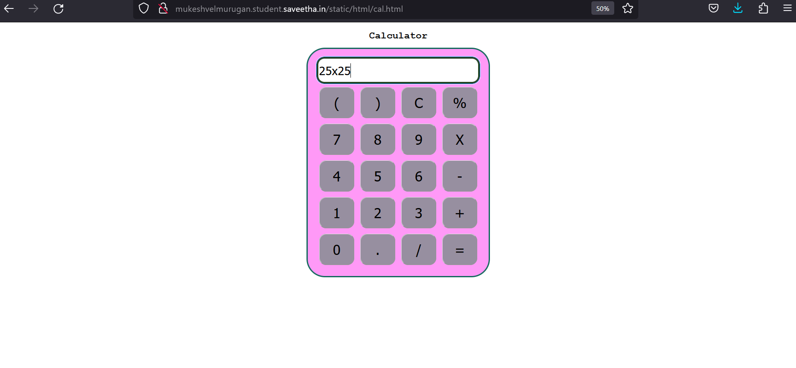
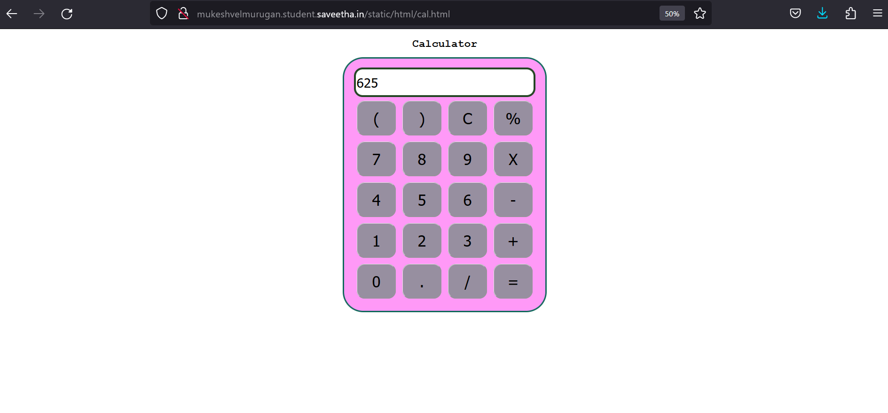
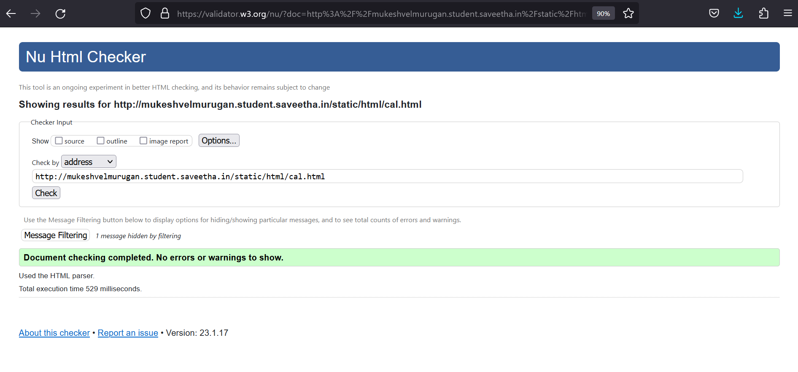

# Design of a Standard Calculator

## AIM:

To design a web application for a standard calculator.

## DESIGN STEPS:

### Step 1:

### Step 2:

### Step 3:

### Step 4:

### Step 5:

### Step 6:

Validate the HTML and CSS code.

### Step 6:

Publish the website in the given URL.

## PROGRAM :

## OUTPUT:
(i)

(ii)

## validation:

## Result:
The program for designing a simple calculator using JavaScript css and html is executed successfully.
